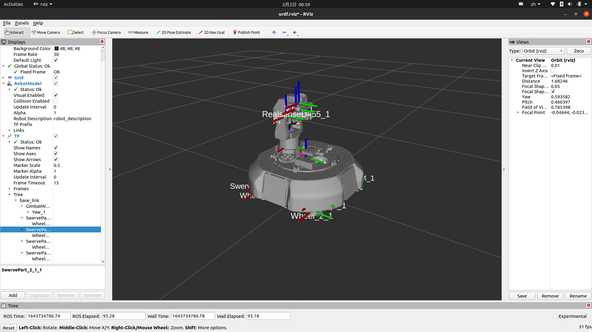
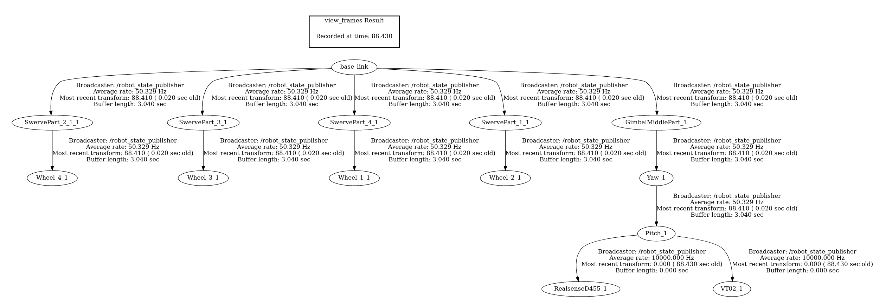

# InfantryRobotSimulator

## 本仓库属于[诺丁汉大学RoboMaster团队](https://github.com/UoN-Lancet)AnywareInLoop系统


## 安装
```
mkdir catkin_ws/src
cd catkin_ws/src
git clone https://github.com/UoN-Lancet/InfantryRobotSimulator
catkin_make
```

## 依赖
```bash
sudo apt-get install ros-$(distro)-joint-state* 
sudo apt-get install ros-$(distro)-robot-state* 
sudo apt-get install ros-$(distro)-gazebo*
sudo apt-get install ros-$(distro)-controller*
sudo apt-get install ros-$(distro)-effort-controllers
sudo apt-get install ros-$(distro)-velocity-controllers
```

本步兵模拟器涉及自动步兵模拟，使用Cartographer进行SLAM，对于配置Cartographer并在ROS环境中运行，请参阅[官方文档](https://google-cartographer-ros.readthedocs.io/en/latest/compilation.html)

为加载步兵1v1场地，需要在.bashrc中添加环境变量，注意要将`catkin_ws`改为工程所在工作空间的路径：
```bash
echo "export GAZEBO_MODEL_PATH=$(catkin_ws)/src/InfantryRobotSimulator/infantry_description/world" >> ~/.bashrc
source ~/.bashrc
```

## 运行

### 打开gazebo模拟器，显示机器人

```bash
roslaunch infantry_description gazebo.launch
```

### 打开控制器，加载控制器

```bash
roslaunch infantry_description controller.launch
```

### 打开运动控制节点

```bash
roslaunch infantry_motion_control motion_controller.launch
```

### 启动SLAM并开始导航

```bash
roslaunch infantry_navigation navigation.launch
```

### 启动rviz查看导航效果

```bash
roslaunch infantry_navigation rviz.launch
```

### 如需进行串口通信进行实机测试，输入以下指令：

### 启动导航节点

```bash
roslaunch infantry_navigation navigation.launch
```

### 打开串口通信

```bash
rosrun infantry_navigation infantry_navigation_node
```


## 控制

### Rev35是中层对地盘的旋转轴，其他轴对应关系在xarco中可以查到

```bash
rostopic pub -r 1 /infantry/Rev35_position_controller/command std_msgs/Float64 "data: 3.1416"
```

### 朝云台指向前进

```bash
rostopic pub -r 10 /cmd_vel geometry_msgs/Twist '{linear: {x: 1, y: 0, z: 0}, angular: {x: 0, y: 0, z: 0}}'
```

### 顺时针小陀螺

```bash
rostopic pub -r 1 /gyro_spin std_msgs/Int32 "data: -1"
```

### 使中层稳定朝向地图x轴方向

```bash
rostopic pub -r 100 /infantry/Rev35_position_controller/command std_msgs/Float64 "data: 0"
```

## TF



## Todo

- [x] 控制逻辑，使用python或者cpp实现完整控制逻辑
- [x] 加装传感器，实现SLAM并发布odom
- [x] 实现2D平面导航
- [x] 用cartographer替换gmapping提高SLAM的稳定性
- [x] 加装IMU
- [x] 建立自动步兵1V1场地
- [ ] 使模型TF坐标x方向向前
- [x] 移动小陀螺
- [x] 底盘旋转稳定中层朝向
- [ ] 提升移动小陀螺流畅性
- [ ] 中层改为速度控制